# 💊 Drug Use Prevention Support System (DUPSS)

> A full-stack web application developed as part of the Software Engineering Project for SE1854 class at FPT University.

---

## 👨‍🏫 Course Info
- **Subject**: Software Engineering Project  
- **Class**: SE1854  
- **Institution**: FPT University  

---

## 👥 Team Members

| Name                  | Role               |
|-----------------------|--------------------|
| Hồ Lê Hữu Bằng        | Leader/BE          |
| Phạm Đình Khôi        | Back-End Developer |
| Lương Phạm Bình Minh  | Back-End Developer |
| Nguyễn Chinh Nhân     | Front-End Developer|
| Lê Nguyễn Hồng Phúc   | Back-End Developer |

---

## 🧩 Project Overview

DUPSS is a drug use prevention support system designed to:
- Educate users through online courses and campaigns  
- Provide access to consultation appointments  
- Offer blogs and informative resources  
- Manage users across different roles: Guest, Member, Staff, Consultant, Manager, and Admin  

Built using **Blazor**, **Web API**, **CSS**, **C#** and **JavaScript** .

---

## 🚀 Features

- 👤 Role-based access control
- 📚 Online course registration
- 📅 Appointment booking system
- 📢 Campaigns and blog articles
- 📊 Dashboards for different user roles
- 🧑‍💻 Fully responsive UI with accessibility support

---

## 📸 Screenshots

### 🏠 Homepage 

### 🏠 Homepage 
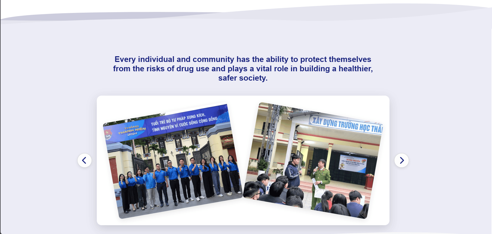

### 👤 Profile Page
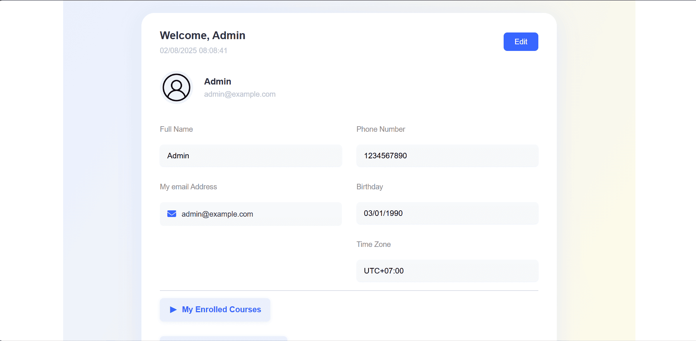

### 📅 Appointment Booking
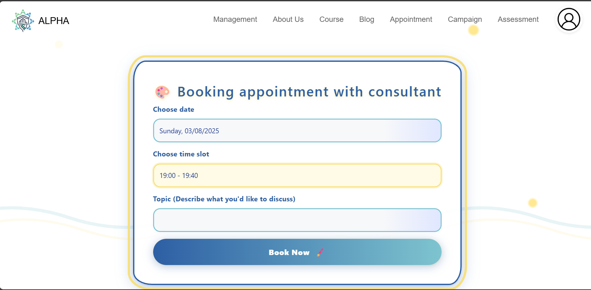

### 📚 Course 
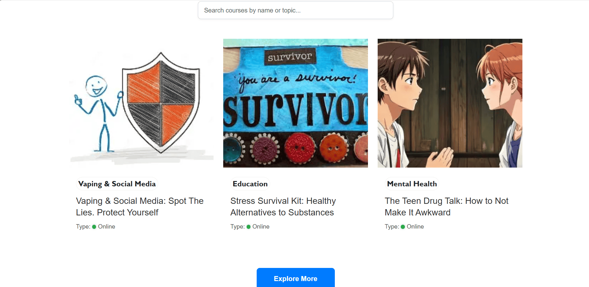

### 📚 Course 
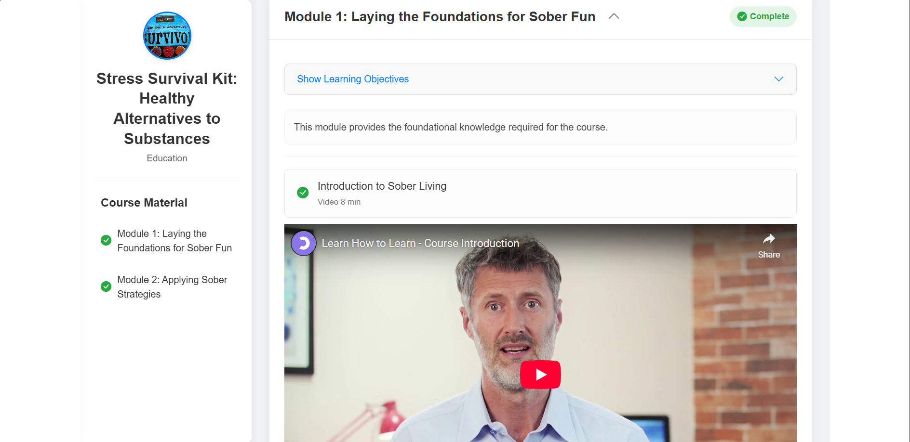

### 📝 Blog 
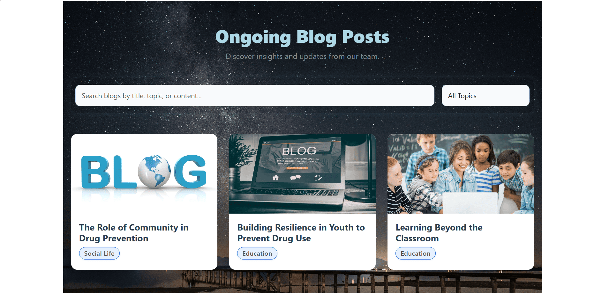

### 📝 Blog 
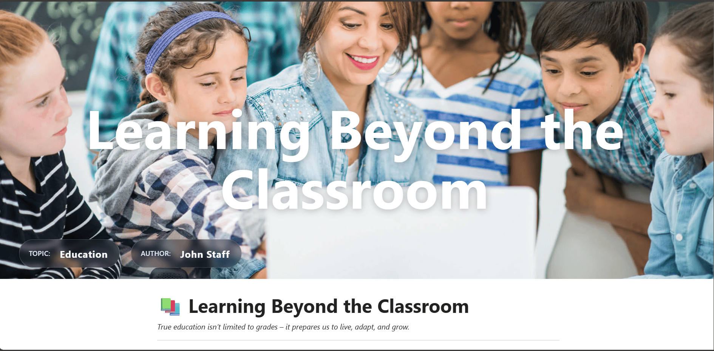

### 📝 Assessment 
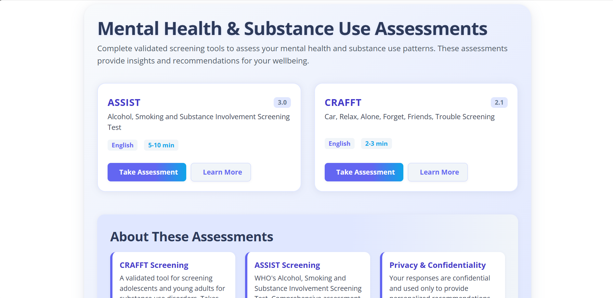

### 📝 Assessment 
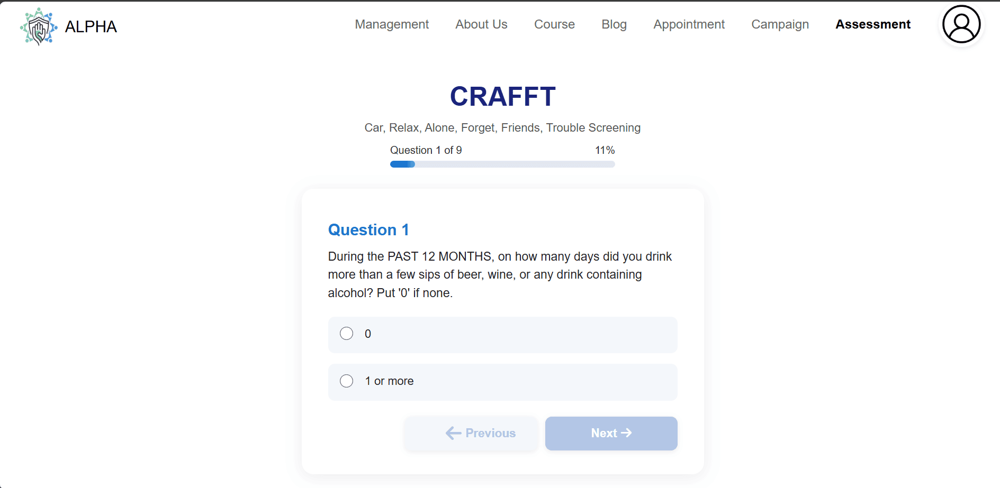

### 📊 Dashboard
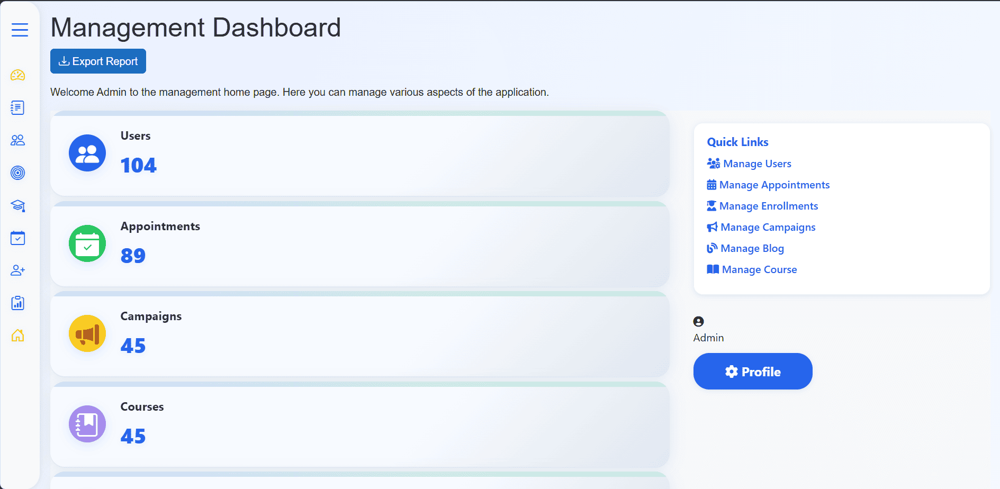

### 🧾 About Us
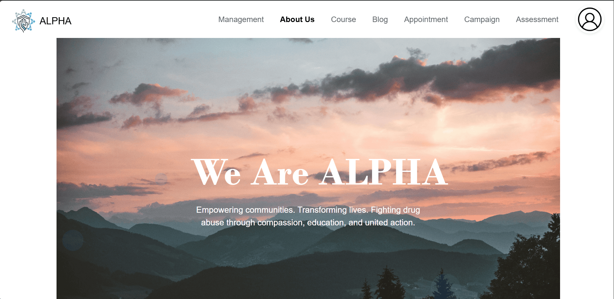

### Login
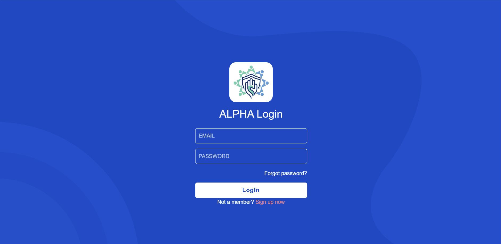

---

## ⚙️ Technologies Used

- ASP.NET Core Blazor Web App
- ASP.NET Core Web API
- PostgreSQL for database
- HTML, CSS, JavaScript
- Git/Github for version control
